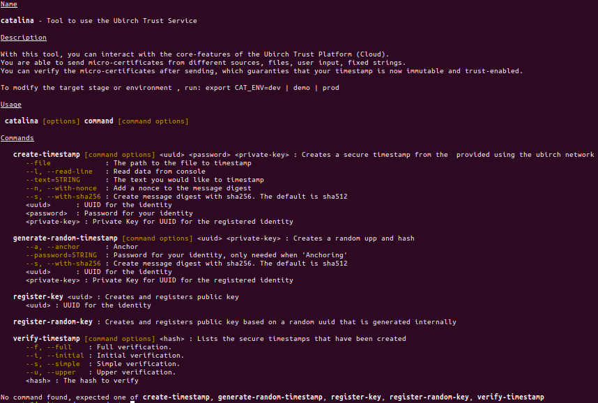

# Catalina


## General Description



With this tool, you can interact with the core features of the _Ubirch Trust Platform_ (Cloud). 
You are able to send micro-certificates from different sources, files, user input, fixed strings. 
You can verify the micro-certificates after sending, which guaranties that your timestamp is now immutable and trust-enabled.

This is a tool that allows to use the _Ubirch Trust Service_. This tool is a command line.
Its features are:

* **create timestamps:** There are different kinds of timestamps you can create. You can create a timestamp based
on a file, on text, on user input, and random text.

All the above mentioned timestamps can be salted/added with a nonce.

* **register keys**

In order to send create a timestamp, a proper public key should be registered on the _Ubirch Trust Service_.
This option allows you to quickly register an existing key, or it allows you to generate a random key and 
identity id.

* **verify timestamps**

This feature verifies the generated timestamps. You can select the type of verification 
you would like to have. 

## Env Variables

For every one of these feature, you can set the stage at which the system will point to on the _Ubirch Platform_ [dev, demo, prod]
By default dev wil be used. 

### Ubirch Stage

To modify this, export the following variable. The following are the expected values: [dev, demo, prod]

```
export CAT_ENV=dev 
```

### Data Folder

```
export CAT_DATA_FOLDER=$HOME 
```

### Http Port

```
export CAT_HTTP_PORT=8080 
```

### Data Sending Url

```
export CAT_DATA_SENDING_URL=https://ubproxy.enchain.it/ubproxy/api/v1/upp 
```

### Key Registration Url

```
export CAT_KEY_REGISTRATION_URL=https://key.dev.ubirch.com/api/keyService/v1/pubkey 
```

### Verification Base Url

```
export CAT_VERIFICATION_BASE_URL=https://verify.dev.ubirch.com
```

## Install Latest Version

To install the latest version: [List of releases](https://github.com/Carlos-Augusto/cat/releases)

_Download_ 

```shell script
curl -s -L https://github.com/Carlos-Augusto/cat/releases/download/0.0.7/install.sh --output install.sh
```

_Make it executable_ 

```shell script
chmod +x install.sh
```

_Options_

```shell script
install [-r] [-p] [-c CAT_HOME] [-e CAT_HOME]
-r -> will remove possible existing install
-c -> will remove possible existing install on custom place
-p -> will prompt if same install is found
-e -> will prompt if same install is found and will install on custom place
```

_Example_

Run script with best option for you.
```shell script
./install.sh -r
```

## Run the CLI

```shell script
$ catalina
```

You can use the options as they show up. In case you are interested in checking what version you are running,
you can use the version command (_catalina version_)

## Install from sources

Clone the project
```shell script
git clone git@github.com:Carlos-Augusto/cat.git 
```

Enter the cat folder or where you cloned it into
```shell script
cd cat 
```

Run the installation script. Use as argument the path for your catalina install.
```shell script
./build.sh PATH_FOR_INSTALL
```

For quick access, add your installation folder to your path.
```shell script
export PATH=$INSTALL_FOLDER:\$PATH"
```

Run to see the options
```shell script
./catalina.sh
```

## Http Interface

Catalina offers a simple http endpoint that can be used to create timestamps.
Catalina runs on the port 8080

### Run the HTTP interface:

```shell script
$ catalina-http
```

### Creating a Timestamp

```
POST
----
 http://localhost:8080/send/:uuid
  where uuid is the device/identity id registered

HEADERS
-------
x-pr: The private key that belongs to the identity.
      It is the raw representation of the key, base64 encoded.
x-pass: The password obtained when registering the identity.
        The passwords should be BASE64 encoded.
x-proxy-HEADER-NAME: If you need to redirect especific headers to the sending 
        destination, you can use this header. Just put the header you need to 
        redirect together with the x-proxy and the value. The system will take these
        headers and plug them into the request to the sending service.
Content-Type: Although not explicitily needed, you usually would use ->
 'text/plain'               for simple texts  
 'application/octet-stream' for binary data
 'application/json'         for json format

x-json-format: When using a content type 'application/json', you can also pass this header to better 
               control the formatting of the incoming json value. ->
 'compact' to format the incoming value in a compacted fashion.
 'pretty'  to format the incoming value in a more verbose, prettier fashion
 'none'    to not perform any formatting

Note:
 that when the content type is json, the system checks to see if the value is a valid json value.
 that when by default the formatting option is 'none'
      

BODY
----
The body should contain the data that you would like to anchor.
```

#### Example

```shell script
curl -s -X POST -H 'x-pk:PRIV_KEY' -H 'x-pass:BASE64_PASS' -d 'HELLO WORLD' http://localhost:8080/send/7A44acd5-91e1-4230-833a-2f386e09b96f
```

### Checking Configs

You can check the current configs by visiting: [http://localhost:8080/configs](http://localhost:8080/configs)
